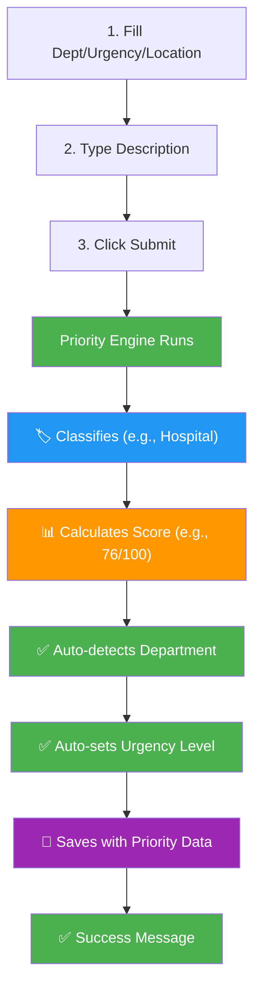

# 🧪 Quick Testing Guide - Priority Engine

## ✅ Current Status
- Dev server: **RUNNING** ✓
- Priority engine: **INTEGRATED** ✓
- Dashboard: **UPDATED** ✓

---

## 🚀 How to Test

### 1. Open Your Dashboard
```
👉 Go to: http://localhost:3000/dashboard
```

### 2. Open Browser Console
```
Press: F12 (Windows) or Cmd+Option+I (Mac)
Tab: Console
```

### 3. Try These Test Cases

#### Test Case 1: Pothole (Should be Municipal)
```
Description: "Large pothole on Main Street causing damage"
- Department: Leave EMPTY (auto-detect)
- Location: Capture or enter any location
- Don't select department!
```
**Expected Console Output:**
```
🔍 Classifying: "large pothole on main street causing damage"

📋 Checking PRIMARY keywords:
   ✓ Municipal: "pothole" (1x) = +5
   ✓ Municipal: "damage" (1x) = +5

📊 Primary score total: 10

✅ CLASSIFICATION RESULT:
   Category: Municipal
   Scores: {"Hospital":0,"Fire":0,"Municipal":10,"Police":0}
   Confidence: 95.0%

✅ PRIORITY RESULT:
   Category: Municipal (Base: 62%)
   Urgency: moderate
   Score: 25/100
   Level: LOW
   Response Time: 3600s

🏷️ Auto-detected department: municipal corporation
✅ Request submitted! Priority: LOW (25/100) → Municipal
```

#### Test Case 2: Fire (Should be Fire - CRITICAL)
```
Description: "Building on fire with flames spreading"
- Department: Leave EMPTY (auto-detect)
- Location: Capture
```
**Expected:**
```
🏷️ Category: Fire | Confidence: 98.0%
✅ PRIORITY RESULT:
   Category: Fire (Base: 87%)
   Score: 87/100
   Level: CRITICAL
   Response Time: 60s

🏷️ Auto-detected department: fire
✅ Request submitted! Priority: CRITICAL (87/100) → Fire
```

#### Test Case 3: Injury (Should be Hospital - HIGH)
```
Description: "Person injured and bleeding from accident"
- Department: Leave EMPTY (auto-detect)
- Location: Capture
```
**Expected:**
```
🏷️ Category: Hospital | Confidence: 92.0%
✅ PRIORITY RESULT:
   Category: Hospital (Base: 98%)
   Score: 76/100
   Level: HIGH
   Response Time: 300s

🏷️ Auto-detected department: hospital
✅ Request submitted! Priority: HIGH (76/100) → Hospital
```

#### Test Case 4: Robbery (Should be Police - HIGH)
```
Description: "Robbery in progress with weapon"
- Department: Leave EMPTY (auto-detect)
- Location: Capture
```
**Expected:**
```
🏷️ Category: Police | Confidence: 95.0%
✅ PRIORITY RESULT:
   Category: Police (Base: 75%)
   Score: 75/100
   Level: HIGH
   Response Time: 300s

🏷️ Auto-detected department: police
✅ Request submitted! Priority: HIGH (75/100) → Police
```

---

## 📋 What to Check

### ✅ Automatic Department Detection
- [x] No need to manually select department
- [x] Description should auto-detect correct dept
- [x] Console shows: "🏷️ Auto-detected department: ..."

### ✅ Priority Scoring
- [x] Priority score calculated (0-100)
- [x] Priority level assigned (LOW/MEDIUM/HIGH/CRITICAL)
- [x] Base score for category shown (Hospital: 98%, Fire: 87%, etc.)

### ✅ Confidence Calculation
- [x] Shows % confidence in classification
- [x] Higher for clear categories, lower for ambiguous
- [x] Displayed in console

### ✅ Console Logging
- [x] Shows keyword matching
- [x] Shows raw scores for each category
- [x] Shows final classification
- [x] Shows priority calculation

### ✅ Form Behavior
- [x] Department field optional (auto-fills)
- [x] Urgency auto-updates based on priority
- [x] Success message shows priority info

---

##❌ Troubleshooting

### Problem: "Auto-detected department: undefined"
**Cause**: Description doesn't contain clear keywords.
**Fix**: Try exact words from keyword lists (see PRIORITY_ENGINE_GUIDE.md)

### Problem: No console logs appearing
**Cause**: Console not open or submitted with empty description
**Fix**: 
1. Open F12 console BEFORE submitting
2. Ensure you type a description
3. Click Submit

### Problem: Priority score is 0 or very low
**Cause**: Description has no matching keywords
**Fix**: Add more relevant keywords. E.g., "pothole" works, but "hole" does not.

### Problem: Wrong department detected
**Cause**: Description matches secondary keywords of wrong category
**Fix**: Be more specific. Instead of "accident", say "person injured in accident"

---

## 🎯 Success Criteria

After integration, you should see:

1. ✅ **Auto-routing works**
   - Submit "pothole" → Goes to Municipal
   - Submit "fire" → Goes to Fire
   - Submit "robbery" → Goes to Police
   - Submit "injured" → Goes to Hospital

2. ✅ **Priority scores are reasonable**
   - Life-threatening emergencies: ≥80 (CRITICAL)
   - Serious issues: 60-79 (HIGH)
   - Normal issues: 40-59 (MEDIUM)
   - Minor issues: <40 (LOW)

3. ✅ **Console shows detailed classification**
   - Lists matching keywords
   - Shows confidence %
   - Explains category choice

4. ✅ **Data is saved with priority info**
   - Each request stores: priority_score, priority_level, detected_category
   - Can view in admin dashboard later

---

## 🔄 Full Test Flow



---

## 📞 Quick Reference

| Category | Base Score | Keywords (Primary) | Example |
|----------|------------|-------------------|---------|
| Hospital | 0.98 | injured, bleeding, medical, ambulance | "Person injured with bleeding" |
| Fire | 0.87 | fire, burning, explosion, blaze | "Building on fire with flames" |
| Police | 0.75 | theft, robbery, assault, weapon | "Robbery in progress" |
| Municipal | 0.62 | pothole, water leak, garbage, sewer | "Pothole on Main Street" |

---

## 📂 Files Modified

1. Created: `lib/priority-engine.ts` (Full logic)
2. Updated: `app/dashboard/page.tsx` (Integration)
3. Updated: `lib/offline-db.ts` (Data types)
4. Created: `PRIORITY_ENGINE_GUIDE.md` (Full docs)

---

**Ready to test! Open http://localhost:3000/dashboard and try submitting a pothole report! 🚀**
